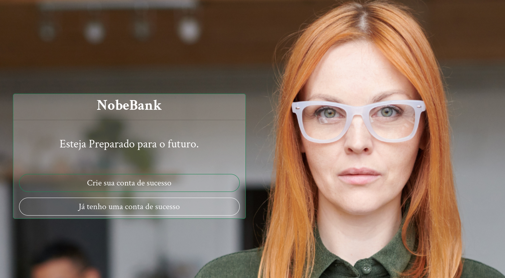

## Home

## Dashboard

## README

Things you may want to cover:

#### Ruby version
 - 3.1.2

#### Configuration

 - To run in dev env install docker previously
 - To build containers: `docker-compose build`
 - Run app: `docker-compose up`
 - Get CONTAINER ID web: `docker ps` and access bash in container web with: `docker exec -it <CONTAINER ID> bash``

#### Inner container bash
  - Install packages: `yarn install`
  - Create database: `bin/rails db:create db:migrate data:migrate`
  - Create user to login: `bin/rails db:seed`

### Test env with rspec

 - Get CONTAINER ID web: `docker ps` and access bash in container web with: `docker exec -it <CONTAINER ID> bash`
 - run all tests: `bin/rspec`
 - run tests in documentation format: `bin/rspec --format documentation`

### DEMO

[LINK DEMO](https://nobebank-brasil.herokuapp.com/)
